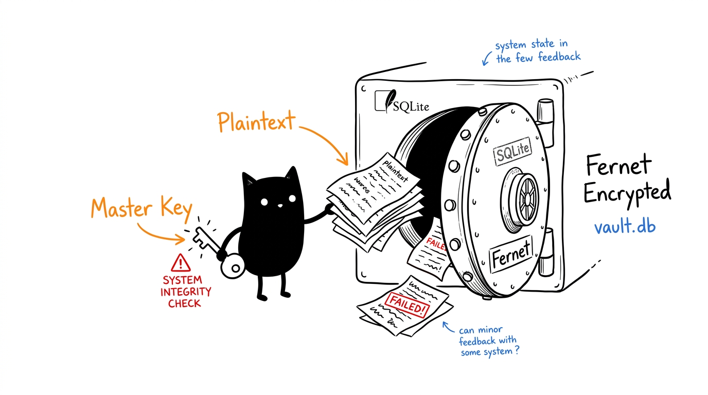
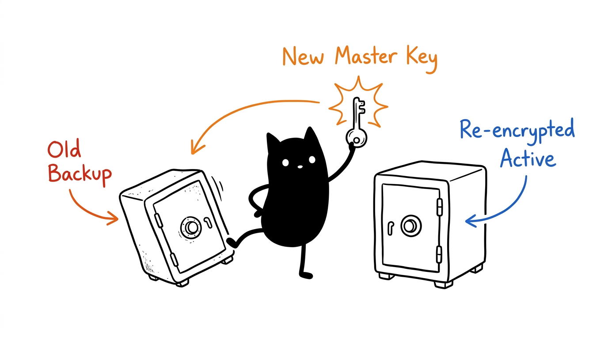
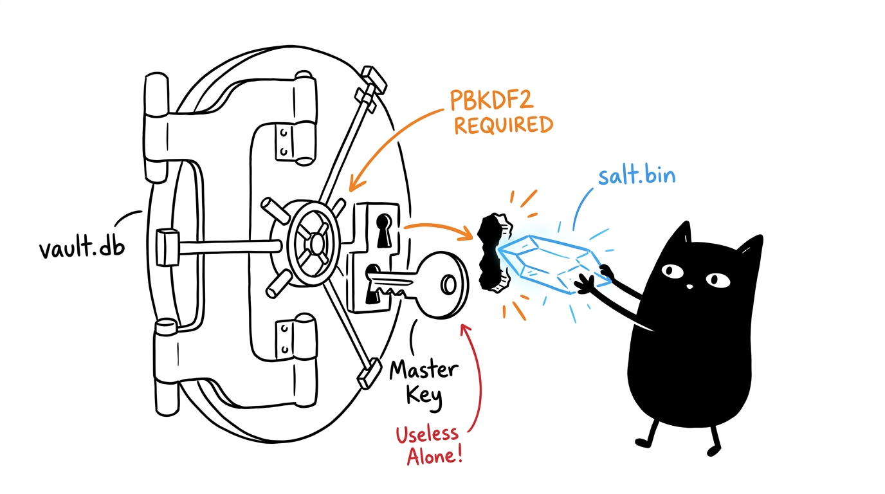

# Mema Vault



Mema Vault stores local credentials in SQLite. Passwords are encrypted with Fernet using a key derived from your master key through PBKDF2HMAC-SHA256. Service names, usernames, and metadata remain plaintext.

The vault does not send data over the network.

## Contents

- [Requirements](#requirements)
- [Master key access](#master-key-access)
- [Usage](#usage)
  - [Store or replace a credential](#store-or-replace-a-credential)
  - [Retrieve a credential](#retrieve-a-credential)
  - [List credentials](#list-credentials)
  - [Verify vault](#verify-vault)
  - [Run with secret as env var](#run-with-secret-as-env-var)
  - [Export / Import](#export--import-encrypted-portable)
  - [Delete a credential](#delete-a-credential)
- [Use cases](#use-cases)
- [Rotate the master key](#rotate-the-master-key)
- [Storage paths](#storage-paths)
- [Security boundaries](#security-boundaries)
- [Backup and recovery](#backup-and-recovery)
- [Tests](#tests)

## Requirements

- Python 3.9 or newer
- [`cryptography`](https://cryptography.io/)

Install the dependency:

```bash
python3 -m pip install cryptography
```

## Master key access

### Terminal users

Run a command without setting a key. The CLI prompts for it without displaying the input:

```bash
python3 scripts/vault.py list
```

### Agents and automation

Provide the key through the process environment:

```bash
export MEMA_VAULT_MASTER_KEY='your-master-key'
python3 scripts/vault.py list
```

`MASTER_KEY` is accepted for compatibility with older installations, but prints a deprecation warning. New integrations should use `MEMA_VAULT_MASTER_KEY`.

Do not place the master key in a command argument. Avoid committing it to shell scripts or environment files.

## Usage

### Store or replace a credential

Interactive use prompts for the password:

```bash
python3 scripts/vault.py set github azzar --meta "personal account"
```

For automation, pass the password through stdin:

```bash
printf '%s\n' "$GITHUB_TOKEN" | \
  python3 scripts/vault.py set github azzar --password-stdin
```

Using stdin keeps the password out of the process argument list. Take care with shell history when constructing pipelines.

### Retrieve a credential

Passwords are masked by default:

```bash
python3 scripts/vault.py get github
```

Print the complete password only when another process requires it:

```bash
python3 scripts/vault.py get github --show
python3 scripts/vault.py get bca-card --json        # machine-readable, masked
python3 scripts/vault.py get bca-card --json --show # machine-readable, raw
```

`--show` writes secrets to standard output. Do not use it in shared terminals, logs, screenshots, or captured agent output.

### Typed records (card / address / note / apikey / generic)

`set` stores classic logins. `store --kind` stores structured records with
validation. List kinds with `python3 scripts/vault.py types`.

```bash
# credit/debit card (number Luhn-checked, expiry MM/YY, cvv 3-4 digits)
python3 scripts/vault.py store bca --kind card \
  --field cardholder="Azzar" --secret-field number \
  --field expiry="08/28" --field cvv="123"

# alamat (street + city required)
python3 scripts/vault.py store rumah --kind address --fields-json \
  '{"street":"Jl. Mawar 12","city":"Bandung","province":"Jawa Barat","postal":"40111","country":"ID","phone":"+62 812 0000 1111"}'

# secure note / api key / free-form
python3 scripts/vault.py store todo --kind note --field title="x" --field body="ingat bayar"
printf '%s\n' "$TOKEN" | python3 scripts/vault.py store gh --kind apikey --password-stdin
python3 scripts/vault.py store misc --kind generic --field k1=v1 --field k2=v2
```

`--secret-field NAME` reads a value via prompt/stdin so secrets never land in
process args or shell history. `--field k=v` may repeat; `--fields-json`
takes a JSON object. Card numbers print masked except the last 4 digits.
`get`/`list --json` include the record `kind`; `list` shows `[kind]` per row.

### List credentials

```bash
python3 scripts/vault.py list
python3 scripts/vault.py list --json
python3 scripts/vault.py list --warn-days 30
```

This prints service names and usernames. It does not print passwords. `list` shows `age` and warns when `>90d`. `--json` outputs machine-readable JSON for agents.

### Verify vault

```bash
python3 scripts/vault.py verify
```

Checks master key + salt without exposing secrets. Useful for CI health checks.

### Run with secret as env var

Inject a secret as an env var for one command without printing it:

```bash
python3 scripts/vault.py env github --env GH_TOKEN -- gh auth login
python3 scripts/vault.py env openai -- python3 my_agent.py
```

If `--env` is omitted, the var name defaults to the uppercased service name. This avoids `--show` leakage in logs.

### Export / Import (encrypted, portable)

```bash
python3 scripts/vault.py export --out /tmp/vault.enc
python3 scripts/vault.py import --in /tmp/vault.enc --mode merge
python3 scripts/vault.py import --in /tmp/vault.enc --mode replace
```

`export` creates a single Fernet-encrypted blob (`0600`) using the same master key. `import --mode merge` upserts, `replace` wipes first.

### Delete a credential

```bash
python3 scripts/vault.py delete github
```

Deletion is permanent unless the database has been backed up.

## Use cases

### 1. Agent that needs API keys at runtime

The agent sets `MEMA_VAULT_MASTER_KEY` in its environment (never in code) and pulls secrets on demand. Passwords are decrypted only for the lifetime of the command and masked by default. Prefer `env` over `--show` to avoid log leakage.

```bash
python3 scripts/vault.py env openai -- python3 my_agent.py
python3 scripts/vault.py env github --env GH_TOKEN -- gh api user
```

Use `--show` only when piping into another process. Avoid logging or echoing the value.

### 2. Local dev without dotenv sprawl

Instead of scattering `.env` files, keep all service tokens in one encrypted vault and inject them per command. No plaintext secrets on disk outside `vault.db`/`salt.bin` (both `0600`).

```bash
python3 scripts/vault.py set stripe alice --meta "test mode"
python3 scripts/vault.py set resend alice --meta "transactional email"

# run app with secrets from vault
python3 scripts/vault.py env resend --env RESEND_API_KEY -- npm run dev
```

### 3. Multi-machine sync (manual)

Vaults are local SQLite + salt files. To sync two machines, copy `data/vault.db` + `data/salt.bin` together (losing the salt makes passwords unrecoverable). If both machines have diverged, stage the other vault under `data/from-other/` and merge:

```bash
mkdir -p data/from-other
cp /path/from-other-machine/vault.db data/from-other/vault.db
cp /path/from-other-machine/salt.bin data/from-other/salt.bin
python3 scripts/combine_vaults.py
```

The combiner re-encrypts `from-other` entries with the local salt. Copy the merged `vault.db` + `salt.bin` back to the other machine to converge.

### 4. CI / ephemeral runners

Store the master key as a CI secret, inject it as `MEMA_VAULT_MASTER_KEY`, and keep `vault.db`/`salt.bin` as encrypted artifacts or restore them from a backup. Rotate after exposure.

```bash
export MEMA_VAULT_MASTER_KEY="$CI_VAULT_MASTER_KEY"
python3 scripts/vault.py list
```

## Rotate the master key



For terminal use:

```bash
python3 scripts/vault.py rotate-key
```

For an agent or unattended process:

```bash
export MEMA_VAULT_MASTER_KEY='current-master-key'
export MEMA_VAULT_NEW_MASTER_KEY='replacement-master-key'
python3 scripts/vault.py rotate-key
unset MEMA_VAULT_NEW_MASTER_KEY
```

Rotation re-encrypts every password and creates `vault.db.backup-<timestamp>` beside the active database first. The backup remains encrypted with the old master key. Store that old key until the rotated vault has been verified, then handle the backup according to your retention policy.

## Storage paths



Defaults:

| Data | Path |
| --- | --- |
| Credential database | `data/vault.db` |
| Key-derivation salt | `data/salt.bin` |

Override either path when runtime data should live outside the skill directory:

```bash
export MEMA_VAULT_DB_PATH="$HOME/.local/state/mema-vault/vault.db"
export MEMA_VAULT_SALT_PATH="$HOME/.local/state/mema-vault/salt.bin"
```

Keep the database and salt together in backups. Losing the salt makes the stored passwords undecryptable, even with the correct master key.

The CLI applies mode `0700` to runtime directories and `0600` to the database, salt, and rotation backups.

## Security boundaries

- Fernet authenticates ciphertext and detects an incorrect key or modified credential.
- PBKDF2HMAC-SHA256 uses 480,000 iterations and a random 16-byte salt.
- A `key_verifier` record makes a wrong master key fail even on an empty vault.
- Passwords and typed fields are decrypted only while a command is running.
- Service names, usernames, record kinds, and metadata are visible to anyone who can read the SQLite database. Only passwords + typed fields are encrypted.
- Input is validated: service 1–128 chars, master key minimum 8 chars (12+ recommended), card Luhn + expiry + CVV checks, field size caps, import size caps.
- The master key cannot be recovered from the database. Losing it makes the passwords unrecoverable.
- A process with access to the master key and vault files can decrypt stored passwords.
- `export` blobs are Fernet-encrypted with the same master key (fixed export salt, `0600`); same key is required to import.

## Backup and recovery

Back up both files, or use an encrypted export:

```text
data/vault.db
data/salt.bin
# or
vault.enc  (from: python3 scripts/vault.py export --out vault.enc)
```

Keep backups outside the repository with owner-only permissions. To restore, place the matching database and salt at the configured paths and use the master key that encrypted that database. For `vault.enc`, run `python3 scripts/vault.py import --in vault.enc --mode replace`.

Before replacing a working vault, copy it to a separate directory. Do not overwrite the only known-good database during recovery.

## Tests

Run the regression suite:

```bash
python3 -m unittest discover -s tests -v
```

The tests use temporary vaults. They do not read or modify `data/vault.db`.
